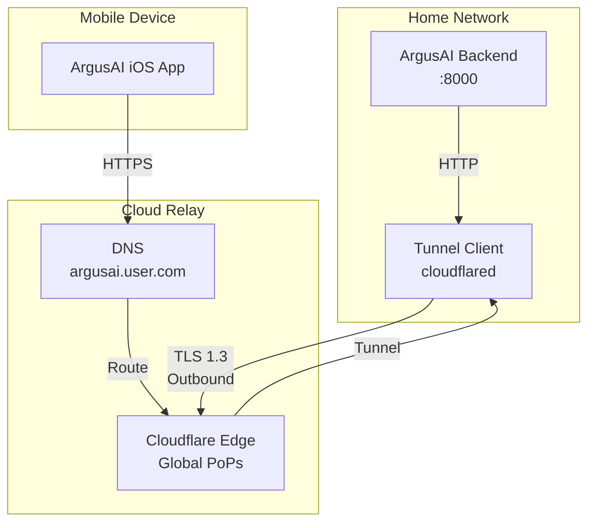
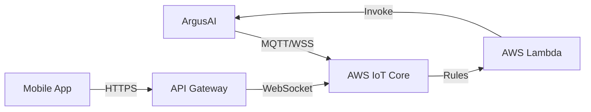
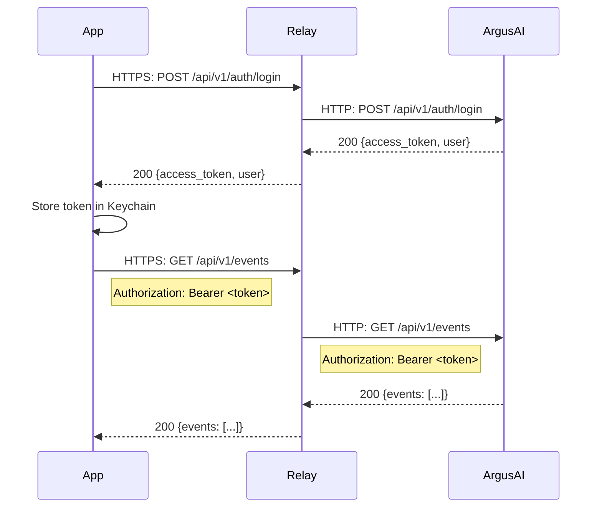
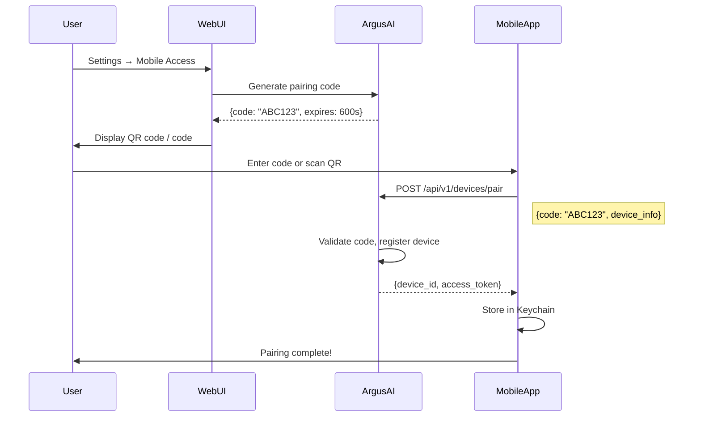
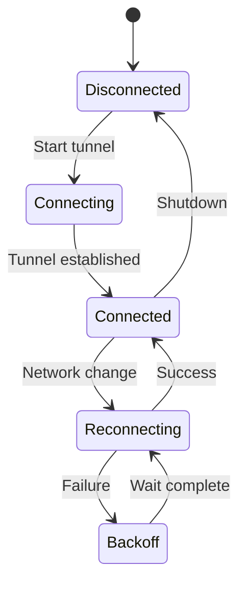
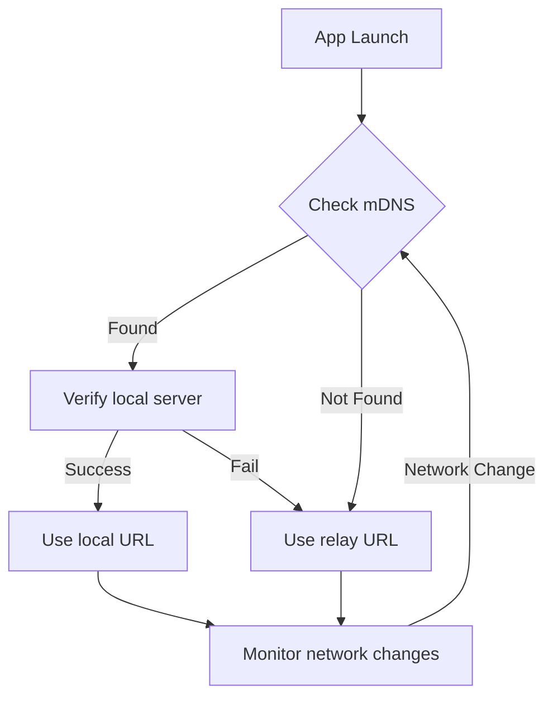

# Cloud Relay Architecture

**Version:** 1.0.0
**Last Updated:** 2025-12-25
**Story:** P10-5.3

This document defines the architecture for secure remote access to ArgusAI from mobile devices without requiring port forwarding or exposing the local network.

---

## Table of Contents

1. [Executive Summary](#executive-summary)
2. [Problem Statement](#problem-statement)
3. [Requirements](#requirements)
4. [Architecture Overview](#architecture-overview)
5. [Relay Technology Options](#relay-technology-options)
6. [Recommended Approach](#recommended-approach)
7. [Security Model](#security-model)
8. [Device Pairing Flow](#device-pairing-flow)
9. [NAT Traversal](#nat-traversal)
10. [Bandwidth Optimization](#bandwidth-optimization)
11. [Local Network Fallback](#local-network-fallback)
12. [Implementation Roadmap](#implementation-roadmap)
13. [Cost Analysis](#cost-analysis)

---

## Executive Summary

ArgusAI is deployed on users' local networks (home servers, Raspberry Pi, NAS devices). Mobile apps need secure access to the ArgusAI API when users are away from home. This architecture document defines how to enable remote access without:

- Requiring users to configure port forwarding
- Exposing the local ArgusAI instance to the public internet
- Storing user data on third-party relay servers

**Recommended Solution:** Cloudflare Tunnel provides the best balance of simplicity, security, and cost for personal/home use. AWS IoT offers an enterprise-grade alternative for larger deployments.

---

## Problem Statement

### Current State

```
┌─────────────────────────────────────────────────────────┐
│                    Home Network                          │
│  ┌─────────────┐     ┌─────────────┐     ┌──────────┐  │
│  │  ArgusAI    │◄────│   UniFi     │◄────│  Camera  │  │
│  │  Backend    │     │   Protect   │     │          │  │
│  │  :8000      │     │             │     │          │  │
│  └─────────────┘     └─────────────┘     └──────────┘  │
│         ▲                                               │
│         │ Local Access (works)                          │
│  ┌──────┴──────┐                                        │
│  │   iPhone    │                                        │
│  │  on WiFi    │                                        │
│  └─────────────┘                                        │
└─────────────────────────────────────────────────────────┘
                          │
                    NAT / Firewall
                          │
                    ┌─────┴─────┐
                    │  Internet │
                    └─────┬─────┘
                          │
                 ┌────────┴────────┐
                 │     iPhone      │
                 │   on Cellular   │
                 │                 │
                 │   ❌ No Access  │
                 └─────────────────┘
```

### Desired State

```
┌─────────────────────────────────────────────────────────┐
│                    Home Network                          │
│  ┌─────────────┐     ┌─────────────┐                    │
│  │  ArgusAI    │◄────│  Cloudflare │                    │
│  │  Backend    │     │  Tunnel     │                    │
│  │  :8000      │     │  (outbound) │                    │
│  └─────────────┘     └──────┬──────┘                    │
│         ▲                   │                            │
│         │ Local             │ Secure Tunnel              │
│  ┌──────┴──────┐            │                            │
│  │   iPhone    │            │                            │
│  │  on WiFi    │            │                            │
│  └─────────────┘            │                            │
└─────────────────────────────┼───────────────────────────┘
                              │
                    NAT / Firewall (no config needed)
                              │
                    ┌─────────┴─────────┐
                    │   Cloudflare      │
                    │   Edge Network    │
                    └─────────┬─────────┘
                              │
                 ┌────────────┴────────────┐
                 │         iPhone          │
                 │       on Cellular       │
                 │                         │
                 │   ✅ Secure Access      │
                 │   via argusai.user.com  │
                 └─────────────────────────┘
```

---

## Requirements

### Functional Requirements (from PRD-phase10.md)

| ID | Requirement |
|----|-------------|
| FR48 | Cloud relay architecture document defines secure tunnel approach |
| FR49 | Architecture addresses NAT traversal for remote access |
| FR50 | Architecture defines device pairing and authentication flow |
| FR51 | Architecture considers bandwidth optimization for thumbnails/video |

### Non-Functional Requirements

| Category | Requirement |
|----------|-------------|
| **Security** | End-to-end encryption (TLS 1.3) |
| **Security** | Zero knowledge at relay (no unencrypted data access) |
| **Security** | Device authentication before API access |
| **Usability** | Zero configuration for users (no port forwarding) |
| **Usability** | Works on any ISP, including CGNAT |
| **Performance** | <200ms additional latency vs local access |
| **Cost** | Free or <$10/month for personal use |
| **Reliability** | Auto-reconnect on network changes |

---

## Architecture Overview

### High-Level Architecture



### Data Flow

```
Mobile App                    Cloudflare Edge               ArgusAI Backend
    │                              │                              │
    │  1. HTTPS Request            │                              │
    │  GET /api/v1/events          │                              │
    │  Host: argusai.user.com      │                              │
    │ ─────────────────────────────▶                              │
    │                              │                              │
    │                              │  2. Route to Tunnel          │
    │                              │  (pre-established)           │
    │                              │ ─────────────────────────────▶
    │                              │                              │
    │                              │  3. HTTP Request             │
    │                              │  GET /api/v1/events          │
    │                              │ ─────────────────────────────▶
    │                              │                              │
    │                              │  4. HTTP Response            │
    │                              │  200 OK {events: [...]}      │
    │                              │ ◀─────────────────────────────
    │                              │                              │
    │  5. HTTPS Response           │                              │
    │  200 OK {events: [...]}      │                              │
    │ ◀─────────────────────────────                              │
```

---

## Relay Technology Options

### Option A: Cloudflare Tunnel (Recommended)

Cloudflare Tunnel (formerly Argo Tunnel) creates a secure, outbound-only connection from the ArgusAI server to Cloudflare's edge network.

```
┌─────────────────┐         ┌──────────────────┐         ┌─────────────┐
│   ArgusAI +     │ ───────▶│   Cloudflare     │◀─────── │  Mobile App │
│   cloudflared   │  TLS    │   Edge (global)  │  HTTPS  │             │
└─────────────────┘         └──────────────────┘         └─────────────┘
     Outbound Only              Zero Trust                   Any Network
```

**Pros:**
- ✅ Free tier supports up to 50 users
- ✅ No server infrastructure to manage
- ✅ Automatic TLS certificates via Let's Encrypt
- ✅ Global edge network for low latency
- ✅ Zero Trust access controls available
- ✅ Works on any ISP, including CGNAT
- ✅ Built-in DDoS protection

**Cons:**
- ❌ Requires Cloudflare account
- ❌ Domain must use Cloudflare DNS
- ❌ Depends on Cloudflare infrastructure
- ❌ `cloudflared` daemon must run on ArgusAI server

**Implementation:**
```bash
# Install cloudflared
curl -L https://github.com/cloudflare/cloudflared/releases/latest/download/cloudflared-linux-amd64 -o /usr/local/bin/cloudflared
chmod +x /usr/local/bin/cloudflared

# Authenticate (one-time)
cloudflared tunnel login

# Create tunnel
cloudflared tunnel create argusai

# Configure routing
cloudflared tunnel route dns argusai argusai.example.com

# Run tunnel (or as systemd service)
cloudflared tunnel run argusai
```

**Configuration File (config.yml):**
```yaml
tunnel: argusai-tunnel-id
credentials-file: /root/.cloudflared/argusai-tunnel-id.json

ingress:
  - hostname: argusai.example.com
    service: http://localhost:8000
  - service: http_status:404
```

---

### Option B: AWS IoT + API Gateway

AWS IoT Core with API Gateway provides an enterprise-grade relay using AWS managed services.

```
┌─────────────────┐         ┌──────────────────┐         ┌─────────────┐
│   ArgusAI +     │ ───────▶│   AWS IoT Core   │◀─────── │  Mobile App │
│   MQTT Client   │  MQTT   │   + Lambda       │  HTTPS  │             │
└─────────────────┘   TLS   │   + API Gateway  │         └─────────────┘
```

**Pros:**
- ✅ Enterprise-grade, highly scalable
- ✅ Pay-per-use pricing
- ✅ Full AWS ecosystem integration
- ✅ Device shadows for offline state
- ✅ Fine-grained IAM permissions

**Cons:**
- ❌ Complex setup (IoT Core + Lambda + API Gateway)
- ❌ Requires AWS account and billing
- ❌ Higher latency than edge-based solutions
- ❌ Ongoing costs (~$1-5/month for light usage)
- ❌ Region-specific deployment

**Architecture:**


---

### Option C: Self-Hosted Relay (frp)

A self-hosted reverse proxy using [frp](https://github.com/fatedier/frp) on a VPS with a public IP.

```
┌─────────────────┐         ┌──────────────────┐         ┌─────────────┐
│   ArgusAI +     │ ───────▶│   VPS            │◀─────── │  Mobile App │
│   frpc client   │  TCP    │   frps server    │  HTTPS  │             │
└─────────────────┘   TLS   │   (public IP)    │         └─────────────┘
```

**Pros:**
- ✅ Full control over infrastructure
- ✅ No third-party dependencies
- ✅ Open source
- ✅ One-time setup, predictable costs

**Cons:**
- ❌ Requires VPS with public IP ($5-10/month)
- ❌ User must manage server updates and security
- ❌ Single point of failure (no global redundancy)
- ❌ SSL certificate management required

**Alternatives:**
- [rathole](https://github.com/rapiz1/rathole) - Rust-based, high performance
- [bore](https://github.com/ekzhang/bore) - Simple TCP tunneling
- [ngrok](https://ngrok.com/) - Managed service with free tier

---

## Recommended Approach

### Primary: Cloudflare Tunnel

For the majority of ArgusAI users (home/personal use), **Cloudflare Tunnel** is the recommended solution:

| Criterion | Score | Notes |
|-----------|-------|-------|
| Cost | ⭐⭐⭐⭐⭐ | Free for personal use |
| Simplicity | ⭐⭐⭐⭐ | Single daemon, minimal config |
| Security | ⭐⭐⭐⭐⭐ | TLS 1.3, Zero Trust ready |
| Reliability | ⭐⭐⭐⭐⭐ | Global edge, 99.99% uptime |
| Performance | ⭐⭐⭐⭐ | Edge PoPs in most regions |

### Alternative: Self-Hosted for Privacy

For users who require complete control or cannot use Cloudflare:

| Criterion | Score | Notes |
|-----------|-------|-------|
| Cost | ⭐⭐⭐ | $5-10/month VPS |
| Simplicity | ⭐⭐ | Server management required |
| Security | ⭐⭐⭐⭐ | User-controlled, but manual |
| Reliability | ⭐⭐⭐ | Single server, no redundancy |
| Performance | ⭐⭐⭐ | Depends on VPS location |

---

## Security Model

### End-to-End Encryption

All traffic between mobile app and ArgusAI backend is encrypted:

```
Mobile App ──TLS 1.3──▶ Relay ──TLS 1.3──▶ ArgusAI
            (public)          (tunnel)

Data is encrypted at:
1. App → Relay: HTTPS (TLS 1.3)
2. Relay → Tunnel: QUIC or TLS
3. Tunnel → ArgusAI: HTTP (internal)
```

**Key Security Properties:**

1. **Relay Zero-Knowledge:** Cloudflare terminates TLS but ArgusAI can add an additional layer using Access policies or JWT validation
2. **Certificate Pinning:** Mobile apps should pin the relay certificate to prevent MITM
3. **Token-Based Auth:** JWT tokens from mobile-auth-flow.md authenticate all API requests

### Authentication Flow



### Cloudflare Access (Optional)

For additional security, Cloudflare Access can enforce:

- **Device Posture:** Require managed devices or specific OS versions
- **Identity Provider:** Integrate with Google, GitHub, or custom OIDC
- **Geo-Restrictions:** Allow access only from specific countries

---

## Device Pairing Flow

### Initial Pairing

When a new mobile device connects for the first time:



### Pairing Code Structure

```json
{
  "code": "ABC123",
  "expires_at": "2025-12-25T12:00:00Z",
  "server_url": "https://argusai.example.com",
  "fingerprint": "sha256:a1b2c3d4..."
}
```

**QR Code Contents:**
```
argusai://pair?code=ABC123&url=https://argusai.example.com&fp=sha256:a1b2c3d4...
```

### Device Management

| Endpoint | Method | Description |
|----------|--------|-------------|
| `/api/v1/devices` | GET | List paired devices |
| `/api/v1/devices/pair` | POST | Pair new device |
| `/api/v1/devices/{id}` | DELETE | Revoke device |
| `/api/v1/devices/{id}/rename` | PUT | Rename device |

---

## NAT Traversal

### How It Works

Traditional remote access requires port forwarding because connections are initiated from outside the network:

```
Internet ──▶ Router ──▶ ArgusAI
             (blocked by NAT)
```

Cloud relay reverses this by having ArgusAI initiate the connection:

```
ArgusAI ──outbound──▶ Relay ◀──inbound── Mobile App
         (allowed)           (allowed)
```

### Connection Lifecycle



### Keepalive and Reconnection

| Parameter | Cloudflare Tunnel | frp |
|-----------|-------------------|-----|
| Keepalive interval | 5 seconds | Configurable |
| Reconnect delay | Exponential backoff | Configurable |
| Max retries | Unlimited | Configurable |
| Heartbeat timeout | 30 seconds | 30 seconds |

**Cloudflare handles this automatically.** For frp:

```ini
# frpc.ini
[common]
server_addr = vps.example.com
server_port = 7000
heartbeat_interval = 30
heartbeat_timeout = 90

[argusai]
type = tcp
local_ip = 127.0.0.1
local_port = 8000
remote_port = 8000
```

---

## Bandwidth Optimization

### Thumbnail Optimization

Mobile networks have limited bandwidth. Optimize thumbnail delivery:

| Original | Mobile Optimized |
|----------|------------------|
| JPEG 1920x1080 | WebP 480x270 |
| ~500KB | ~15KB |

**Implementation:**

1. Add thumbnail quality parameter to API:
   ```
   GET /api/v1/events/{id}/thumbnail?quality=mobile
   ```

2. Server-side processing:
   ```python
   def get_thumbnail_mobile(event_id: str) -> bytes:
       thumbnail = get_original_thumbnail(event_id)
       return convert_to_webp(thumbnail, max_width=480, quality=75)
   ```

### Adaptive Video Quality

For live preview and video clips:

| Connection | Resolution | Bitrate |
|------------|------------|---------|
| WiFi | 1080p | 3 Mbps |
| LTE | 720p | 1.5 Mbps |
| 3G | 480p | 500 Kbps |

**Client-Side Detection:**
```swift
import Network

let monitor = NWPathMonitor()
monitor.pathUpdateHandler = { path in
    if path.isExpensive { // Cellular
        setVideoQuality(.medium)
    } else {
        setVideoQuality(.high)
    }
}
```

### Event Pagination

Reduce payload sizes for event lists:

```json
{
  "events": [...],
  "pagination": {
    "page": 1,
    "per_page": 20,
    "total": 150,
    "has_next": true
  }
}
```

**Mobile-specific endpoint:**
```
GET /api/v1/events?per_page=20&fields=id,timestamp,thumbnail_url,description
```

---

## Local Network Fallback

### Why Fallback?

When the mobile device is on the same network as ArgusAI, local access is:
- **Faster:** No relay latency
- **More reliable:** No dependency on internet
- **Lower cost:** No data usage on metered connections

### Detection Mechanism



### mDNS/Bonjour Discovery

ArgusAI broadcasts its presence on the local network:

**Service Type:** `_argusai._tcp.local.`

**TXT Records:**
```
version=1.0.0
api_port=8000
ssl=true
fingerprint=sha256:a1b2c3d4...
```

**iOS Discovery:**
```swift
import Network

let browser = NWBrowser(for: .bonjour(type: "_argusai._tcp.", domain: "local."), using: .tcp)

browser.stateUpdateHandler = { state in
    if case .ready = state {
        // ArgusAI found on local network
    }
}

browser.browseResultsChangedHandler = { results, changes in
    for result in results {
        if case .bonjour(let name, _, _) = result.endpoint {
            // Connect to local ArgusAI
        }
    }
}

browser.start(queue: .main)
```

### URL Resolution Logic

```swift
class ServerResolver {
    private let relayURL: URL
    private var localURL: URL?

    func resolveServerURL() async -> URL {
        // Try mDNS first
        if let local = await discoverLocalServer() {
            if await verifyServer(local) {
                self.localURL = local
                return local
            }
        }

        // Fall back to relay
        return relayURL
    }

    private func verifyServer(_ url: URL) async -> Bool {
        do {
            let (_, response) = try await URLSession.shared.data(from: url.appendingPathComponent("api/v1/health"))
            return (response as? HTTPURLResponse)?.statusCode == 200
        } catch {
            return false
        }
    }
}
```

### Split-Horizon DNS

For users with custom domains, configure DNS to resolve differently:

| Query Source | Resolution |
|--------------|------------|
| Local network | `192.168.1.100` (local IP) |
| External | `relay.cloudflare.com` (relay) |

This requires advanced DNS configuration and is optional.

---

## Implementation Roadmap

### Phase 1: Foundation (Future Sprint)

1. Add Cloudflare Tunnel installation to `install.sh`
2. Create `/api/v1/relay/status` endpoint
3. Add relay configuration to Settings UI
4. Document setup in README

### Phase 2: Device Pairing (Future Sprint)

1. Implement `/api/v1/devices/pair` endpoint
2. Add pairing code generation
3. Create QR code display in web UI
4. Mobile app: pairing flow

### Phase 3: Local Fallback (Future Sprint)

1. Add mDNS/Bonjour service advertisement
2. Mobile app: network detection
3. Mobile app: automatic URL switching
4. Connection quality monitoring

### Phase 4: Bandwidth Optimization (Future Sprint)

1. Add mobile-optimized thumbnail endpoint
2. Implement adaptive video quality
3. Add network-aware caching
4. Compress event payloads

---

## Cost Analysis

### Cloudflare Tunnel (Recommended)

| Tier | Cost | Features |
|------|------|----------|
| Free | $0/month | 50 users, basic tunnel |
| Teams | $7/user/month | Zero Trust, device posture |
| Enterprise | Custom | SLA, support, analytics |

**For personal use: Free tier is sufficient.**

### AWS IoT Alternative

| Service | Usage | Estimated Cost |
|---------|-------|----------------|
| IoT Core | 1M messages/month | $1.00 |
| API Gateway | 1M requests/month | $3.50 |
| Lambda | 1M invocations | $0.20 |
| Data Transfer | 10GB | $0.90 |
| **Total** | | **~$5.60/month** |

### Self-Hosted Alternative

| Service | Cost |
|---------|------|
| VPS (DigitalOcean/Vultr) | $5-10/month |
| Domain | ~$10/year |
| SSL (Let's Encrypt) | Free |
| **Total** | **~$6-11/month** |

---

## Related Documentation

- [Mobile Authentication Flow](./mobile-auth-flow.md) - JWT and device auth patterns
- [OpenAPI Specification](./openapi-v1.yaml) - Complete API reference
- [Mobile Push Architecture](./mobile-push-architecture.md) - Planned (P10-5.4)

---

## Changelog

| Version | Date | Changes |
|---------|------|---------|
| 1.0.0 | 2025-12-25 | Initial architecture documentation (Story P10-5.3) |
