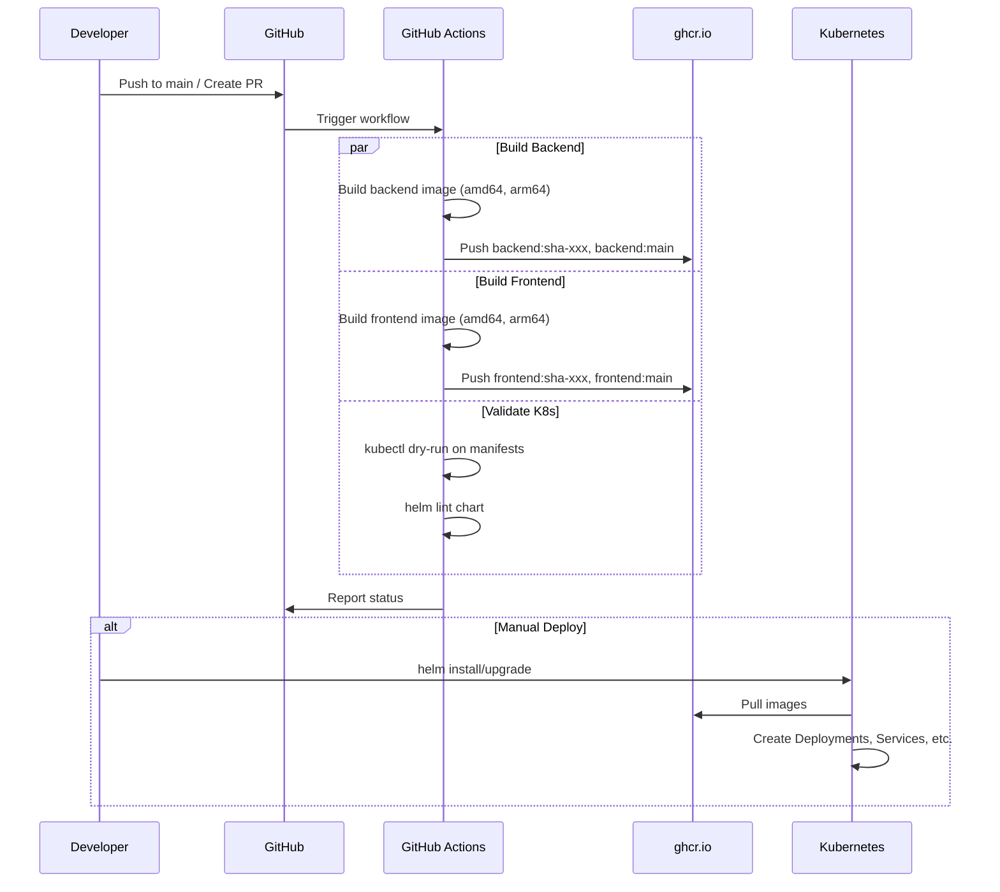
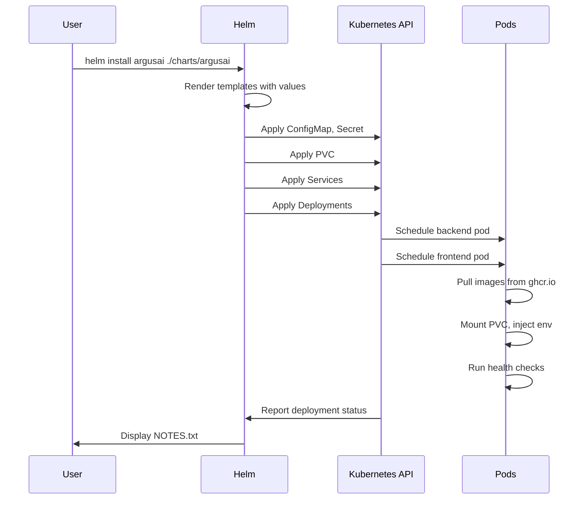

# Epic Technical Specification: Kubernetes & Helm

Date: 2025-12-24
Author: Brent
Epic ID: P10-3
Status: Draft

---

## Overview

Epic P10-3 enables ArgusAI deployment on Kubernetes clusters with production-grade tooling. Building upon the Docker containerization completed in Epic P10-2, this epic delivers Kubernetes manifests (Deployment, Service, ConfigMap, Secret, PVC), a Helm chart for configurable deployments, and CI/CD pipelines for automated container image builds and registry publishing.

This epic transforms ArgusAI from a docker-compose-only deployment into an enterprise-ready, cloud-native application that can run on any Kubernetes cluster (minikube, k3s, EKS, GKE, AKS, etc.) with consistent configuration through Helm values.

## Objectives and Scope

### In Scope

1. **Kubernetes Deployment Manifests** - Backend and frontend Deployments with resource limits, probes, and replica configuration
2. **Kubernetes Service Resources** - ClusterIP Services for internal communication, optional Ingress for external access
3. **ConfigMap and Secrets** - Configuration management for non-sensitive and sensitive values
4. **PersistentVolumeClaim** - Storage for database, thumbnails, frames, and certificates
5. **Helm Chart** - Parameterized chart with values.yaml supporting dev/staging/prod environments
6. **Container CI/CD Pipeline** - GitHub Actions workflow for building, tagging, and pushing images to ghcr.io
7. **Manifest Validation** - CI pipeline includes kubectl dry-run validation

### Out of Scope

- Kubernetes cluster provisioning or management (users provide their own cluster)
- Ingress controller installation (users must have ingress-nginx, traefik, or similar)
- Certificate management with cert-manager (users handle TLS certificates)
- Horizontal Pod Autoscaler (HPA) implementation (documented as optional extension)
- Operators or Custom Resource Definitions (CRDs)
- Helm chart publishing to a public chart repository
- Multi-tenancy or namespace isolation patterns

## System Architecture Alignment

### Current Deployment Architecture

From `docs/architecture/deployment-architecture.md` and Epic P10-2 (Docker Containerization):
- Backend: FastAPI container on port 8000, health check at `/api/v1/system/health`
- Frontend: Next.js standalone container on port 3000
- Database: SQLite (data/app.db) or external PostgreSQL
- Storage: Persistent volumes for data/thumbnails, data/frames, data/certs
- Container Images: `ghcr.io/bbengt1/argusai-backend:latest`, `ghcr.io/bbengt1/argusai-frontend:latest`

### Kubernetes Architecture

```
+-------------------------------------------------------------------------------------+
|                                Kubernetes Cluster                                    |
|  +-------------------------------------------------------------------------------+  |
|  |                            argusai Namespace                                   |  |
|  |                                                                               |  |
|  |  +-------------------+    +-------------------+    +-------------------+      |  |
|  |  |  Ingress (opt)   |    |   ConfigMap       |    |    Secret         |      |  |
|  |  |  - /             |    |   - LOG_LEVEL     |    |   - ENCRYPTION_KEY|      |  |
|  |  |  - /api/*        |    |   - CORS_ORIGINS  |    |   - JWT_SECRET    |      |  |
|  |  |  - /ws           |    |   - DATABASE_URL  |    |   - API_KEYS      |      |  |
|  |  +--------+---------+    +-------------------+    +-------------------+      |  |
|  |           |                       |                       |                   |  |
|  |           v                       v                       v                   |  |
|  |  +-------------------+    +-------------------+                              |  |
|  |  |  backend Service |    | frontend Service  |                              |  |
|  |  |  ClusterIP:8000  |    | ClusterIP:3000    |                              |  |
|  |  +--------+---------+    +--------+---------+                               |  |
|  |           |                       |                                          |  |
|  |           v                       v                                          |  |
|  |  +-------------------+    +-------------------+                              |  |
|  |  | backend Deploy   |    | frontend Deploy   |                              |  |
|  |  | Replicas: 1-3    |    | Replicas: 1-2     |                              |  |
|  |  | - FastAPI        |    | - Next.js         |                              |  |
|  |  | - OpenCV         |    | - Standalone      |                              |  |
|  |  | - ffmpeg         |    +-------------------+                              |  |
|  |  +--------+---------+                                                        |  |
|  |           |                                                                   |  |
|  |           v                                                                   |  |
|  |  +-------------------+                                                        |  |
|  |  | PVC: argusai-data|                                                        |  |
|  |  | - app.db         |                                                        |  |
|  |  | - thumbnails/    |                                                        |  |
|  |  | - frames/        |                                                        |  |
|  |  | - certs/         |                                                        |  |
|  |  +-------------------+                                                        |  |
|  |                                                                               |  |
|  +-------------------------------------------------------------------------------+  |
+-------------------------------------------------------------------------------------+
```

### Technology Stack Integration

| Component | K8s Resource | Notes |
|-----------|--------------|-------|
| Backend Container | Deployment | ghcr.io/bbengt1/argusai-backend |
| Frontend Container | Deployment | ghcr.io/bbengt1/argusai-frontend |
| Internal Routing | Service (ClusterIP) | backend:8000, frontend:3000 |
| External Access | Ingress (optional) | Requires ingress controller |
| Configuration | ConfigMap | Non-sensitive settings |
| Secrets | Secret | Encrypted API keys, JWT secret |
| Persistence | PVC | ReadWriteOnce, default 10Gi |
| External DB | PostgreSQL | Via DATABASE_URL to external service |

## Detailed Design

### Services and Modules

#### Story P10-3.1: Kubernetes Deployment Manifests

**File:** `k8s/backend-deployment.yaml`

```yaml
apiVersion: apps/v1
kind: Deployment
metadata:
  name: argusai-backend
  labels:
    app: argusai
    component: backend
spec:
  replicas: 1
  selector:
    matchLabels:
      app: argusai
      component: backend
  template:
    metadata:
      labels:
        app: argusai
        component: backend
    spec:
      securityContext:
        runAsNonRoot: true
        runAsUser: 1000
        fsGroup: 1000
      containers:
        - name: backend
          image: ghcr.io/bbengt1/argusai-backend:latest
          ports:
            - containerPort: 8000
              name: http
          envFrom:
            - configMapRef:
                name: argusai-config
            - secretRef:
                name: argusai-secrets
          resources:
            requests:
              memory: "512Mi"
              cpu: "250m"
            limits:
              memory: "1Gi"
              cpu: "1000m"
          volumeMounts:
            - name: data
              mountPath: /app/data
          livenessProbe:
            httpGet:
              path: /api/v1/system/health
              port: 8000
            initialDelaySeconds: 15
            periodSeconds: 20
            timeoutSeconds: 5
            failureThreshold: 3
          readinessProbe:
            httpGet:
              path: /api/v1/system/health
              port: 8000
            initialDelaySeconds: 5
            periodSeconds: 10
            timeoutSeconds: 5
            failureThreshold: 3
      volumes:
        - name: data
          persistentVolumeClaim:
            claimName: argusai-data
```

**File:** `k8s/frontend-deployment.yaml`

```yaml
apiVersion: apps/v1
kind: Deployment
metadata:
  name: argusai-frontend
  labels:
    app: argusai
    component: frontend
spec:
  replicas: 1
  selector:
    matchLabels:
      app: argusai
      component: frontend
  template:
    metadata:
      labels:
        app: argusai
        component: frontend
    spec:
      securityContext:
        runAsNonRoot: true
        runAsUser: 1001
      containers:
        - name: frontend
          image: ghcr.io/bbengt1/argusai-frontend:latest
          ports:
            - containerPort: 3000
              name: http
          env:
            - name: NEXT_PUBLIC_API_URL
              value: "http://argusai-backend:8000"
            - name: NEXT_PUBLIC_WS_URL
              value: "ws://argusai-backend:8000"
          resources:
            requests:
              memory: "256Mi"
              cpu: "100m"
            limits:
              memory: "512Mi"
              cpu: "500m"
          livenessProbe:
            httpGet:
              path: /
              port: 3000
            initialDelaySeconds: 15
            periodSeconds: 20
          readinessProbe:
            httpGet:
              path: /
              port: 3000
            initialDelaySeconds: 10
            periodSeconds: 10
```

**Key Design Decisions:**
- Non-root security context for both deployments
- Resource requests/limits for predictable scheduling
- Separate liveness and readiness probes
- ConfigMap/Secret references via `envFrom`
- PVC mount for persistent data (backend only)

#### Story P10-3.2: Kubernetes Service and Config Resources

**File:** `k8s/backend-service.yaml`

```yaml
apiVersion: v1
kind: Service
metadata:
  name: argusai-backend
  labels:
    app: argusai
    component: backend
spec:
  type: ClusterIP
  ports:
    - port: 8000
      targetPort: 8000
      protocol: TCP
      name: http
  selector:
    app: argusai
    component: backend
```

**File:** `k8s/frontend-service.yaml`

```yaml
apiVersion: v1
kind: Service
metadata:
  name: argusai-frontend
  labels:
    app: argusai
    component: frontend
spec:
  type: ClusterIP
  ports:
    - port: 3000
      targetPort: 3000
      protocol: TCP
      name: http
  selector:
    app: argusai
    component: frontend
```

**File:** `k8s/configmap.yaml`

```yaml
apiVersion: v1
kind: ConfigMap
metadata:
  name: argusai-config
  labels:
    app: argusai
data:
  DEBUG: "false"
  LOG_LEVEL: "INFO"
  CORS_ORIGINS: "http://localhost:3000"
  DATABASE_URL: "sqlite:///data/app.db"
  SSL_ENABLED: "false"
```

**File:** `k8s/secret.yaml` (Template - values must be base64 encoded)

```yaml
apiVersion: v1
kind: Secret
metadata:
  name: argusai-secrets
  labels:
    app: argusai
type: Opaque
data:
  # Generate: echo -n "your-key" | base64
  ENCRYPTION_KEY: ""  # Required
  JWT_SECRET_KEY: ""  # Required
  OPENAI_API_KEY: ""  # Optional
  XAI_API_KEY: ""     # Optional
  ANTHROPIC_API_KEY: ""  # Optional
  GOOGLE_AI_API_KEY: ""  # Optional
  VAPID_PRIVATE_KEY: ""  # Optional
  VAPID_PUBLIC_KEY: ""   # Optional
```

**File:** `k8s/pvc.yaml`

```yaml
apiVersion: v1
kind: PersistentVolumeClaim
metadata:
  name: argusai-data
  labels:
    app: argusai
spec:
  accessModes:
    - ReadWriteOnce
  resources:
    requests:
      storage: 10Gi
  # storageClassName: standard  # Uncomment and set for specific storage class
```

**File:** `k8s/ingress.yaml` (Optional)

```yaml
apiVersion: networking.k8s.io/v1
kind: Ingress
metadata:
  name: argusai-ingress
  labels:
    app: argusai
  annotations:
    nginx.ingress.kubernetes.io/proxy-body-size: "50m"
    nginx.ingress.kubernetes.io/websocket-services: "argusai-backend"
spec:
  ingressClassName: nginx
  rules:
    - host: argusai.local  # Change to your domain
      http:
        paths:
          - path: /api
            pathType: Prefix
            backend:
              service:
                name: argusai-backend
                port:
                  number: 8000
          - path: /ws
            pathType: Prefix
            backend:
              service:
                name: argusai-backend
                port:
                  number: 8000
          - path: /docs
            pathType: Prefix
            backend:
              service:
                name: argusai-backend
                port:
                  number: 8000
          - path: /openapi.json
            pathType: Exact
            backend:
              service:
                name: argusai-backend
                port:
                  number: 8000
          - path: /
            pathType: Prefix
            backend:
              service:
                name: argusai-frontend
                port:
                  number: 3000
  # tls:  # Uncomment for TLS
  #   - hosts:
  #       - argusai.local
  #     secretName: argusai-tls
```

#### Story P10-3.3: Helm Chart

**Directory Structure:**

```
charts/argusai/
  Chart.yaml
  values.yaml
  templates/
    _helpers.tpl
    backend-deployment.yaml
    frontend-deployment.yaml
    backend-service.yaml
    frontend-service.yaml
    configmap.yaml
    secret.yaml
    pvc.yaml
    ingress.yaml
    NOTES.txt
```

**File:** `charts/argusai/Chart.yaml`

```yaml
apiVersion: v2
name: argusai
description: AI-powered event detection system for home security
type: application
version: 0.1.0
appVersion: "1.0.0"
keywords:
  - home-security
  - ai
  - vision
  - unifi-protect
maintainers:
  - name: Brent Bengtson
    email: brent@example.com
```

**File:** `charts/argusai/values.yaml`

```yaml
# Global settings
nameOverride: ""
fullnameOverride: ""

# Backend configuration
backend:
  replicaCount: 1
  image:
    repository: ghcr.io/bbengt1/argusai-backend
    tag: "latest"
    pullPolicy: IfNotPresent
  resources:
    requests:
      memory: "512Mi"
      cpu: "250m"
    limits:
      memory: "1Gi"
      cpu: "1000m"
  service:
    type: ClusterIP
    port: 8000

# Frontend configuration
frontend:
  replicaCount: 1
  image:
    repository: ghcr.io/bbengt1/argusai-frontend
    tag: "latest"
    pullPolicy: IfNotPresent
  resources:
    requests:
      memory: "256Mi"
      cpu: "100m"
    limits:
      memory: "512Mi"
      cpu: "500m"
  service:
    type: ClusterIP
    port: 3000

# Configuration
config:
  debug: false
  logLevel: "INFO"
  corsOrigins: "http://localhost:3000"
  databaseUrl: "sqlite:///data/app.db"
  sslEnabled: false

# Secrets (use --set or external secret management)
secrets:
  encryptionKey: ""  # Required
  jwtSecretKey: ""   # Required
  openaiApiKey: ""
  xaiApiKey: ""
  anthropicApiKey: ""
  googleAiApiKey: ""
  vapidPrivateKey: ""
  vapidPublicKey: ""

# Persistence
persistence:
  enabled: true
  storageClass: ""
  accessMode: ReadWriteOnce
  size: 10Gi

# Ingress
ingress:
  enabled: false
  className: nginx
  annotations: {}
  hosts:
    - host: argusai.local
      paths:
        - path: /
          pathType: Prefix
  tls: []

# Pod security context
podSecurityContext:
  runAsNonRoot: true
  runAsUser: 1000
  fsGroup: 1000

# Image pull secrets (for private registries)
imagePullSecrets: []

# Node selector
nodeSelector: {}

# Tolerations
tolerations: []

# Affinity
affinity: {}
```

**File:** `charts/argusai/templates/_helpers.tpl`

```yaml
{{/*
Expand the name of the chart.
*/}}
{{- define "argusai.name" -}}
{{- default .Chart.Name .Values.nameOverride | trunc 63 | trimSuffix "-" }}
{{- end }}

{{/*
Create a default fully qualified app name.
*/}}
{{- define "argusai.fullname" -}}
{{- if .Values.fullnameOverride }}
{{- .Values.fullnameOverride | trunc 63 | trimSuffix "-" }}
{{- else }}
{{- $name := default .Chart.Name .Values.nameOverride }}
{{- printf "%s" $name | trunc 63 | trimSuffix "-" }}
{{- end }}
{{- end }}

{{/*
Common labels
*/}}
{{- define "argusai.labels" -}}
helm.sh/chart: {{ .Chart.Name }}-{{ .Chart.Version | replace "+" "_" }}
app.kubernetes.io/name: {{ include "argusai.name" . }}
app.kubernetes.io/instance: {{ .Release.Name }}
app.kubernetes.io/version: {{ .Chart.AppVersion | quote }}
app.kubernetes.io/managed-by: {{ .Release.Service }}
{{- end }}

{{/*
Selector labels for backend
*/}}
{{- define "argusai.backendSelectorLabels" -}}
app.kubernetes.io/name: {{ include "argusai.name" . }}
app.kubernetes.io/instance: {{ .Release.Name }}
app.kubernetes.io/component: backend
{{- end }}

{{/*
Selector labels for frontend
*/}}
{{- define "argusai.frontendSelectorLabels" -}}
app.kubernetes.io/name: {{ include "argusai.name" . }}
app.kubernetes.io/instance: {{ .Release.Name }}
app.kubernetes.io/component: frontend
{{- end }}
```

**File:** `charts/argusai/templates/NOTES.txt`

```
ArgusAI has been deployed!

1. Get the application URL:
{{- if .Values.ingress.enabled }}
{{- range $host := .Values.ingress.hosts }}
  http{{ if $.Values.ingress.tls }}s{{ end }}://{{ $host.host }}
{{- end }}
{{- else if contains "NodePort" .Values.frontend.service.type }}
  export NODE_PORT=$(kubectl get --namespace {{ .Release.Namespace }} -o jsonpath="{.spec.ports[0].nodePort}" services {{ include "argusai.fullname" . }}-frontend)
  export NODE_IP=$(kubectl get nodes --namespace {{ .Release.Namespace }} -o jsonpath="{.items[0].status.addresses[0].address}")
  echo http://$NODE_IP:$NODE_PORT
{{- else if contains "ClusterIP" .Values.frontend.service.type }}
  kubectl --namespace {{ .Release.Namespace }} port-forward service/{{ include "argusai.fullname" . }}-frontend 3000:3000
  Then open http://localhost:3000
{{- end }}

2. Get backend API URL (for debugging):
  kubectl --namespace {{ .Release.Namespace }} port-forward service/{{ include "argusai.fullname" . }}-backend 8000:8000
  Then open http://localhost:8000/docs

3. Check deployment status:
  kubectl --namespace {{ .Release.Namespace }} get pods -l app.kubernetes.io/instance={{ .Release.Name }}

4. View logs:
  kubectl --namespace {{ .Release.Namespace }} logs -l app.kubernetes.io/component=backend -f
  kubectl --namespace {{ .Release.Namespace }} logs -l app.kubernetes.io/component=frontend -f
```

#### Story P10-3.4: Container CI/CD Pipeline

**File:** `.github/workflows/docker.yml`

```yaml
name: Docker Build and Push

on:
  push:
    branches: [main]
    tags: ['v*']
  pull_request:
    branches: [main]

env:
  REGISTRY: ghcr.io
  BACKEND_IMAGE: ghcr.io/${{ github.repository_owner }}/argusai-backend
  FRONTEND_IMAGE: ghcr.io/${{ github.repository_owner }}/argusai-frontend

jobs:
  build-backend:
    runs-on: ubuntu-latest
    permissions:
      contents: read
      packages: write
    steps:
      - name: Checkout
        uses: actions/checkout@v4

      - name: Set up QEMU
        uses: docker/setup-qemu-action@v3

      - name: Set up Docker Buildx
        uses: docker/setup-buildx-action@v3

      - name: Log in to Container Registry
        if: github.event_name != 'pull_request'
        uses: docker/login-action@v3
        with:
          registry: ${{ env.REGISTRY }}
          username: ${{ github.actor }}
          password: ${{ secrets.GITHUB_TOKEN }}

      - name: Extract metadata
        id: meta
        uses: docker/metadata-action@v5
        with:
          images: ${{ env.BACKEND_IMAGE }}
          tags: |
            type=ref,event=branch
            type=ref,event=pr
            type=semver,pattern={{version}}
            type=semver,pattern={{major}}.{{minor}}
            type=sha,prefix=

      - name: Build and push backend
        uses: docker/build-push-action@v5
        with:
          context: ./backend
          file: ./backend/Dockerfile
          platforms: linux/amd64,linux/arm64
          push: ${{ github.event_name != 'pull_request' }}
          tags: ${{ steps.meta.outputs.tags }}
          labels: ${{ steps.meta.outputs.labels }}
          cache-from: type=gha
          cache-to: type=gha,mode=max

  build-frontend:
    runs-on: ubuntu-latest
    permissions:
      contents: read
      packages: write
    steps:
      - name: Checkout
        uses: actions/checkout@v4

      - name: Set up QEMU
        uses: docker/setup-qemu-action@v3

      - name: Set up Docker Buildx
        uses: docker/setup-buildx-action@v3

      - name: Log in to Container Registry
        if: github.event_name != 'pull_request'
        uses: docker/login-action@v3
        with:
          registry: ${{ env.REGISTRY }}
          username: ${{ github.actor }}
          password: ${{ secrets.GITHUB_TOKEN }}

      - name: Extract metadata
        id: meta
        uses: docker/metadata-action@v5
        with:
          images: ${{ env.FRONTEND_IMAGE }}
          tags: |
            type=ref,event=branch
            type=ref,event=pr
            type=semver,pattern={{version}}
            type=semver,pattern={{major}}.{{minor}}
            type=sha,prefix=

      - name: Build and push frontend
        uses: docker/build-push-action@v5
        with:
          context: ./frontend
          file: ./frontend/Dockerfile
          platforms: linux/amd64,linux/arm64
          push: ${{ github.event_name != 'pull_request' }}
          tags: ${{ steps.meta.outputs.tags }}
          labels: ${{ steps.meta.outputs.labels }}
          cache-from: type=gha
          cache-to: type=gha,mode=max
          build-args: |
            NEXT_PUBLIC_API_URL=http://localhost:8000

  validate-k8s:
    runs-on: ubuntu-latest
    steps:
      - name: Checkout
        uses: actions/checkout@v4

      - name: Set up kubectl
        uses: azure/setup-kubectl@v4

      - name: Validate Kubernetes manifests
        run: |
          for file in k8s/*.yaml; do
            echo "Validating $file..."
            kubectl apply --dry-run=client -f "$file" || echo "Warning: $file may have issues (secrets need values)"
          done

      - name: Set up Helm
        uses: azure/setup-helm@v4

      - name: Lint Helm chart
        run: |
          helm lint charts/argusai

      - name: Template Helm chart
        run: |
          helm template argusai charts/argusai \
            --set secrets.encryptionKey=test \
            --set secrets.jwtSecretKey=test \
            > /dev/null
```

### Data Models and Contracts

No new data models required. Kubernetes resources use standard K8s API objects:
- `apps/v1/Deployment`
- `v1/Service`
- `v1/ConfigMap`
- `v1/Secret`
- `v1/PersistentVolumeClaim`
- `networking.k8s.io/v1/Ingress`

### APIs and Interfaces

**Container Image Registry:**

| Image | Registry | Tags |
|-------|----------|------|
| argusai-backend | ghcr.io/bbengt1/argusai-backend | latest, main, v1.0.0, sha-abc123 |
| argusai-frontend | ghcr.io/bbengt1/argusai-frontend | latest, main, v1.0.0, sha-abc123 |

**Helm Commands:**

```bash
# Install
helm install argusai ./charts/argusai \
  --set secrets.encryptionKey=$(openssl rand -base64 32) \
  --set secrets.jwtSecretKey=$(openssl rand -hex 32)

# Upgrade
helm upgrade argusai ./charts/argusai -f custom-values.yaml

# Uninstall
helm uninstall argusai

# Template (dry-run)
helm template argusai ./charts/argusai --debug
```

**kubectl Commands:**

```bash
# Apply raw manifests
kubectl apply -f k8s/

# Check status
kubectl get pods,svc,pvc -l app=argusai

# Port forward for local access
kubectl port-forward svc/argusai-frontend 3000:3000
kubectl port-forward svc/argusai-backend 8000:8000
```

### Workflows and Sequencing

**CI/CD Pipeline Flow:**



**Helm Installation Flow:**



## Non-Functional Requirements

### Performance

| NFR ID | Requirement | Target | Measurement |
|--------|-------------|--------|-------------|
| NFR-P1 | Pod startup time | < 60 seconds | Time from scheduled to ready |
| NFR-P2 | Container image pull | < 2 minutes | First pull on cold node |
| NFR-P3 | Backend resource footprint | 512Mi-1Gi RAM, 250m-1000m CPU | K8s metrics |
| NFR-P4 | Frontend resource footprint | 256Mi-512Mi RAM, 100m-500m CPU | K8s metrics |
| NFR-P5 | Health check latency | < 100ms | Probe response time |
| NFR-P6 | CI pipeline duration | < 15 minutes | GitHub Actions workflow time |
| NFR-P7 | Multi-arch build time | < 10 minutes per image | Build step duration |

### Security

| NFR ID | Requirement | Implementation |
|--------|-------------|----------------|
| NFR-S1 | Non-root containers | `runAsNonRoot: true`, `runAsUser: 1000` |
| NFR-S2 | No secrets in images | All secrets via K8s Secret or external vault |
| NFR-S3 | Image scanning | Container images scanned in CI (recommend Trivy) |
| NFR-S4 | RBAC compliance | Minimal permissions, no cluster-admin required |
| NFR-S5 | Network isolation | Services use ClusterIP, Ingress for external access |
| NFR-S6 | Secret encoding | Base64 encoding (K8s standard), consider sealed-secrets for GitOps |
| NFR-S7 | TLS termination | Ingress handles TLS, internal traffic unencrypted (cluster trust) |

### Reliability/Availability

| NFR ID | Requirement | Implementation |
|--------|-------------|----------------|
| NFR-R1 | Pod restart policy | `restartPolicy: Always` via Deployment |
| NFR-R2 | Liveness probe | Restart container if health check fails 3x |
| NFR-R3 | Readiness probe | Remove from service if not ready |
| NFR-R4 | Data persistence | PVC survives pod restarts and rescheduling |
| NFR-R5 | Graceful shutdown | SIGTERM handling in containers, `terminationGracePeriodSeconds: 30` |
| NFR-R6 | Rolling updates | Default Deployment strategy with zero downtime |
| NFR-R7 | Volume access | ReadWriteOnce - single node access (SQLite constraint) |

### Observability

| NFR ID | Requirement | Implementation |
|--------|-------------|----------------|
| NFR-O1 | Container logs | stdout/stderr captured by K8s, viewable via `kubectl logs` |
| NFR-O2 | Health status | `kubectl get pods` shows Ready/NotReady status |
| NFR-O3 | Resource metrics | kube-state-metrics / metrics-server for CPU/memory |
| NFR-O4 | Prometheus endpoint | `/metrics` on backend accessible within cluster |
| NFR-O5 | Deployment status | `kubectl rollout status` for tracking updates |
| NFR-O6 | Event logging | K8s events for pod lifecycle issues |

## Dependencies and Integrations

### Prerequisites (Must be completed before this epic)

| Dependency | Source | Status |
|------------|--------|--------|
| Backend Dockerfile | Epic P10-2.1 | Complete |
| Frontend Dockerfile | Epic P10-2.2 | Complete |
| docker-compose.yml | Epic P10-2.4 | Complete |
| Container health endpoints | Existing | Available |

### External Dependencies

| Dependency | Version | Purpose | Required |
|------------|---------|---------|----------|
| Kubernetes Cluster | 1.25+ | Container orchestration | Yes |
| kubectl CLI | 1.25+ | Manifest application | Yes |
| Helm | 3.12+ | Chart installation | Yes (for Helm chart) |
| GitHub Actions | N/A | CI/CD pipeline | Yes |
| ghcr.io (GitHub Container Registry) | N/A | Image hosting | Yes |
| Ingress Controller (nginx/traefik) | Any | External access | Optional |
| metrics-server | 0.6+ | Resource metrics | Optional |

### Internal Integration Points

| Component | Integration | Notes |
|-----------|-------------|-------|
| Backend Container | P10-2.1 Dockerfile | Uses image built by Epic P10-2 |
| Frontend Container | P10-2.2 Dockerfile | Uses image built by Epic P10-2 |
| SQLite Database | PVC mount at /app/data | ReadWriteOnce access |
| External PostgreSQL | DATABASE_URL env var | Optional, for production |
| UniFi Protect | Network access | Must be reachable from cluster |
| AI APIs (OpenAI, etc.) | Secrets for API keys | External HTTPS access required |
| MQTT Broker | Network access | For Home Assistant integration |

### GitHub Actions Dependencies

| Action | Version | Purpose |
|--------|---------|---------|
| actions/checkout | v4 | Repository checkout |
| docker/setup-qemu-action | v3 | Multi-arch emulation |
| docker/setup-buildx-action | v3 | Docker buildx |
| docker/login-action | v3 | Registry authentication |
| docker/metadata-action | v5 | Image tagging |
| docker/build-push-action | v5 | Build and push |
| azure/setup-kubectl | v4 | kubectl installation |
| azure/setup-helm | v4 | Helm installation |

## Acceptance Criteria (Authoritative)

### Story P10-3.1: Kubernetes Deployment Manifests

| AC ID | Acceptance Criteria |
|-------|---------------------|
| AC-3.1.1 | **Given** I have a Kubernetes cluster, **When** I apply the manifests with `kubectl apply -f k8s/`, **Then** backend and frontend Deployments are created with pods in Running state |
| AC-3.1.2 | **Given** the deployments are running, **When** I check pod status with `kubectl get pods`, **Then** all pods show Ready status and readiness probes succeed |
| AC-3.1.3 | **Given** the backend pod is running, **When** the health check endpoint is called, **Then** it returns 200 OK within 100ms |
| AC-3.1.4 | **Given** resource limits are defined, **When** pods are scheduled, **Then** they respect requests (512Mi/256Mi) and limits (1Gi/512Mi) |

### Story P10-3.2: Kubernetes Service and Config Resources

| AC ID | Acceptance Criteria |
|-------|---------------------|
| AC-3.2.1 | **Given** manifests are applied, **When** I check services with `kubectl get svc`, **Then** backend (ClusterIP:8000) and frontend (ClusterIP:3000) Services exist with correct selectors |
| AC-3.2.2 | **Given** ConfigMap is applied, **When** backend pods start, **Then** configuration values (DEBUG, LOG_LEVEL, etc.) are available as environment variables |
| AC-3.2.3 | **Given** Secret is applied with base64-encoded values, **When** backend pods start, **Then** sensitive values (ENCRYPTION_KEY, JWT_SECRET_KEY) are available and not visible in plain text |
| AC-3.2.4 | **Given** PVC is created, **When** backend pod mounts it, **Then** data at /app/data persists across pod restarts |
| AC-3.2.5 | **Given** Ingress is applied (optional), **When** I access the host, **Then** requests route to frontend (/) and backend (/api, /ws, /docs) correctly |

### Story P10-3.3: Helm Chart

| AC ID | Acceptance Criteria |
|-------|---------------------|
| AC-3.3.1 | **Given** the Helm chart exists, **When** I run `helm install argusai ./charts/argusai` with required secrets, **Then** all Kubernetes resources are created and the application is running |
| AC-3.3.2 | **Given** I want to customize the deployment, **When** I provide custom values via `--set` or `-f values.yaml`, **Then** the deployment reflects my configuration (replicas, resources, ingress, etc.) |
| AC-3.3.3 | **Given** ArgusAI is installed, **When** I run `helm upgrade argusai ./charts/argusai`, **Then** the deployment is updated with rolling restart and zero downtime |
| AC-3.3.4 | **Given** the chart is installed, **When** I run `helm uninstall argusai`, **Then** all resources are removed except PVCs (data preserved) |
| AC-3.3.5 | **Given** I run `helm lint charts/argusai`, **Then** the chart passes validation with no errors |

### Story P10-3.4: Container CI/CD Pipeline

| AC ID | Acceptance Criteria |
|-------|---------------------|
| AC-3.4.1 | **Given** I push to the main branch, **When** the CI workflow runs, **Then** Docker images are built for both backend and frontend for linux/amd64 and linux/arm64 |
| AC-3.4.2 | **Given** the build succeeds, **When** images are pushed, **Then** they are tagged with branch name (main), git SHA, and "latest" |
| AC-3.4.3 | **Given** I create a release tag (v1.0.0), **When** the CI workflow runs, **Then** images are tagged with the semantic version (v1.0.0, v1.0) |
| AC-3.4.4 | **Given** I open a pull request, **When** CI runs, **Then** Docker builds are tested (no push) and K8s manifests are validated with dry-run |
| AC-3.4.5 | **Given** the validate-k8s job runs, **When** `helm lint charts/argusai` executes, **Then** the Helm chart passes linting with no errors |
| AC-3.4.6 | **Given** images are pushed, **When** I check ghcr.io, **Then** both argusai-backend and argusai-frontend images are available with multi-arch manifests |

## Traceability Mapping

| AC ID | PRD FR | Story | Component/API | Test Approach |
|-------|--------|-------|---------------|---------------|
| AC-3.1.1 | FR23 | P10-3.1 | k8s/backend-deployment.yaml, k8s/frontend-deployment.yaml | kubectl apply + get pods |
| AC-3.1.2 | FR23 | P10-3.1 | Deployment readinessProbe | kubectl describe pod |
| AC-3.1.3 | FR23 | P10-3.1 | /api/v1/system/health | curl + timing |
| AC-3.1.4 | FR23 | P10-3.1 | resources.requests/limits | kubectl top pods |
| AC-3.2.1 | FR24 | P10-3.2 | k8s/backend-service.yaml, k8s/frontend-service.yaml | kubectl get svc |
| AC-3.2.2 | FR25 | P10-3.2 | k8s/configmap.yaml | kubectl exec + env |
| AC-3.2.3 | FR25 | P10-3.2 | k8s/secret.yaml | kubectl exec + env |
| AC-3.2.4 | FR26 | P10-3.2 | k8s/pvc.yaml | Pod restart test |
| AC-3.2.5 | FR24 | P10-3.2 | k8s/ingress.yaml | HTTP requests |
| AC-3.3.1 | FR27 | P10-3.3 | charts/argusai/ | helm install |
| AC-3.3.2 | FR28 | P10-3.3 | charts/argusai/values.yaml | helm install --set |
| AC-3.3.3 | FR27 | P10-3.3 | Helm release | helm upgrade |
| AC-3.3.4 | FR27 | P10-3.3 | Helm release | helm uninstall |
| AC-3.3.5 | FR27 | P10-3.3 | Chart structure | helm lint |
| AC-3.4.1 | FR29, FR30 | P10-3.4 | .github/workflows/docker.yml | CI run |
| AC-3.4.2 | FR30 | P10-3.4 | docker/metadata-action | Image tags |
| AC-3.4.3 | FR30 | P10-3.4 | docker/metadata-action | Release tags |
| AC-3.4.4 | FR32 | P10-3.4 | validate-k8s job | PR CI run |
| AC-3.4.5 | FR32 | P10-3.4 | helm lint step | CI logs |
| AC-3.4.6 | FR31 | P10-3.4 | ghcr.io registry | docker manifest inspect |

## Risks, Assumptions, Open Questions

### Risks

| Risk | Likelihood | Impact | Mitigation |
|------|------------|--------|------------|
| **R1:** Multi-arch builds increase CI time significantly | Medium | Medium | Use GitHub Actions cache, parallel builds, consider separate arm64 workflow |
| **R2:** SQLite ReadWriteOnce limits horizontal scaling | High | Medium | Document as limitation, recommend PostgreSQL for multi-replica; defer HPA to future |
| **R3:** Users lack Kubernetes experience | Medium | High | Provide comprehensive NOTES.txt, document common issues, include quickstart guide |
| **R4:** Ingress controller variations cause routing issues | Medium | Medium | Test with nginx-ingress, document controller-specific annotations |
| **R5:** Secret management via Helm values exposes secrets in history | Medium | High | Document `--set` for secrets, recommend external secret management (Vault, sealed-secrets) |
| **R6:** PVC storage class compatibility across clusters | Medium | Medium | Leave storageClassName empty by default, document override |

### Assumptions

| ID | Assumption | Validation |
|----|------------|------------|
| A1 | Users have a functioning Kubernetes cluster (minikube, k3s, EKS, GKE, etc.) | Document minimum version (1.25+) |
| A2 | Epic P10-2 Docker containers work correctly | Depends on P10-2 completion |
| A3 | ghcr.io is accessible from user's cluster | Standard for public images |
| A4 | Users understand basic kubectl and helm commands | Provide documentation and examples |
| A5 | Single-replica deployment is acceptable for MVP | Document HPA as future enhancement |
| A6 | External PostgreSQL preferred for production | SQLite only for dev/single-node |

### Open Questions

| ID | Question | Recommendation | Decision By |
|----|----------|----------------|-------------|
| Q1 | Should we support Horizontal Pod Autoscaler in this epic? | **No** - defer to future, document as enhancement | Brent |
| Q2 | Should we publish Helm chart to public chart repo (ArtifactHub)? | **No** - defer, users install from git | Brent |
| Q3 | Should we add Trivy scanning in CI? | **Yes** - add as non-blocking step | Implementation |
| Q4 | Should backend replicas > 1 be supported with SQLite? | **No** - require PostgreSQL for replicas > 1 | Architecture |
| Q5 | Should we template the ingress class name? | **Yes** - via `ingress.className` value | Implementation |

## Test Strategy Summary

### Validation Approach

| Level | Scope | Tools | When |
|-------|-------|-------|------|
| **Manifest Syntax** | YAML validity | kubectl dry-run, yamllint | CI on every PR |
| **Helm Lint** | Chart structure | helm lint | CI on every PR |
| **Helm Template** | Template rendering | helm template | CI on every PR |
| **Local Deploy** | Full stack on minikube/k3s | kubectl, helm | Manual pre-merge |
| **Integration** | End-to-end functionality | Browser, curl | Manual post-deploy |

### CI Validation Tests

```bash
# Manifest validation (in CI)
kubectl apply --dry-run=client -f k8s/

# Helm chart validation (in CI)
helm lint charts/argusai
helm template argusai charts/argusai \
  --set secrets.encryptionKey=test \
  --set secrets.jwtSecretKey=test
```

### Manual Testing Checklist

**Kubernetes Manifests (P10-3.1, P10-3.2):**

- [ ] `kubectl apply -f k8s/pvc.yaml` creates PVC
- [ ] `kubectl apply -f k8s/configmap.yaml` creates ConfigMap
- [ ] `kubectl apply -f k8s/secret.yaml` (with values) creates Secret
- [ ] `kubectl apply -f k8s/backend-deployment.yaml` starts backend pod
- [ ] `kubectl apply -f k8s/frontend-deployment.yaml` starts frontend pod
- [ ] `kubectl apply -f k8s/backend-service.yaml` creates backend Service
- [ ] `kubectl apply -f k8s/frontend-service.yaml` creates frontend Service
- [ ] `kubectl port-forward svc/argusai-frontend 3000:3000` accesses frontend
- [ ] `kubectl port-forward svc/argusai-backend 8000:8000` accesses backend API
- [ ] Backend health check returns 200 OK
- [ ] Frontend loads dashboard
- [ ] Pod restart preserves data in PVC

**Helm Chart (P10-3.3):**

- [ ] `helm install argusai ./charts/argusai --set secrets.encryptionKey=xxx --set secrets.jwtSecretKey=xxx` succeeds
- [ ] `kubectl get all -l app.kubernetes.io/name=argusai` shows all resources
- [ ] NOTES.txt displays correctly after install
- [ ] `helm upgrade argusai ./charts/argusai --set backend.replicaCount=2` (with PostgreSQL) works
- [ ] `helm uninstall argusai` removes resources (PVC preserved)
- [ ] Custom values.yaml overrides work

**CI/CD Pipeline (P10-3.4):**

- [ ] Push to main triggers workflow
- [ ] Backend image built and pushed to ghcr.io
- [ ] Frontend image built and pushed to ghcr.io
- [ ] Images have correct tags (main, sha-xxx)
- [ ] PR triggers build (no push)
- [ ] kubectl dry-run passes in CI
- [ ] helm lint passes in CI
- [ ] Tag v1.0.0 creates versioned images

### Test Environments

| Environment | Cluster | Purpose |
|-------------|---------|---------|
| Local Dev | minikube / Docker Desktop K8s | Developer testing |
| CI | None (dry-run only) | Manifest validation |
| Integration | k3s on VM | Full deployment testing |

### Edge Cases to Test

1. **Pod crash and restart** - Verify data persists, pod recovers
2. **Rolling update** - Verify zero-downtime upgrade
3. **Resource pressure** - Pod eviction and rescheduling
4. **Network policy** - Backend-frontend communication
5. **Ingress TLS** - HTTPS termination (when ingress enabled)
6. **ConfigMap change** - Pod restart on config update
7. **Secret rotation** - Update secrets without pod recreation
